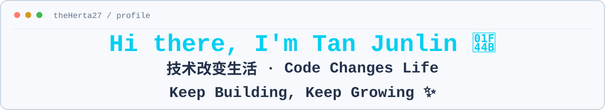

<picture>
  <source media="(prefers-color-scheme: dark)" srcset="./profile/header-dark.svg">
  <source media="(prefers-color-scheme: light)" srcset="./profile/header-light.svg">
  
</picture>

<p align="center"><strong>Building practical software with backend systems and modern AI.</strong></p>

<p align="center">
  <a href="#about">About</a>&nbsp;&nbsp;·&nbsp;&nbsp;
  <a href="#tech-stack">Tech Stack</a>&nbsp;&nbsp;·&nbsp;&nbsp;
  <a href="#github-activity">GitHub Activity</a>
</p>

---

## About

```text
name       : Tan Junlin
education  : Master's student
program    : New Generation Electronic Information Technology
school     : Xidian University
focus      : Backend systems · AI/LLM applications · Agent workflows
direction  : Backend · AI Application · Agent · Software Engineering
```

I build practical software around backend systems and modern AI, with an emphasis on clear workflows, testable behavior, and engineering evidence.

---

## Tech Stack

<p align="center">
  <picture>
    <source media="(prefers-color-scheme: dark)" srcset="https://skillicons.dev/icons?i=py,fastapi,go,postgres,docker,git,unity,cs,unreal,cpp&theme=dark&perline=10">
    <source media="(prefers-color-scheme: light)" srcset="https://skillicons.dev/icons?i=py,fastapi,go,postgres,docker,git,unity,cs,unreal,cpp&theme=light&perline=10">
    
  </picture>
</p>

<p align="center">
  <strong>Backend</strong> · Python · FastAPI · Go · PostgreSQL · Docker<br>
  <strong>AI Agent</strong> · LLM · LangGraph · Agent Workflow<br>
  <strong>Engineering</strong> · Git · pytest<br>
  <strong>Game Runtime</strong> · Unity / C# · Unreal Engine / C++
</p>

---

## GitHub Activity

<div align="center">
  <picture>
    <source media="(prefers-color-scheme: dark)" srcset="./profile/stats-dark.svg">
    <source media="(prefers-color-scheme: light)" srcset="./profile/stats.svg">
    
  </picture>
  <picture>
    <source media="(prefers-color-scheme: dark)" srcset="./profile/top-langs-dark.svg">
    <source media="(prefers-color-scheme: light)" srcset="./profile/top-langs.svg">
    
  </picture>
</div>

<p align="center"><sub>Top Languages reflects public repository composition, not proficiency.</sub></p>

<picture>
  <source media="(prefers-color-scheme: dark)" srcset="https://raw.githubusercontent.com/theHerta27/theHerta27/output/github-contribution-grid-snake-dark.svg">
  <source media="(prefers-color-scheme: light)" srcset="https://raw.githubusercontent.com/theHerta27/theHerta27/output/github-contribution-grid-snake.svg">
  
</picture>

---

<p align="center">
  <strong>Currently building at <a href="https://github.com/theHerta27">@theHerta27</a></strong><br>
  <sub>Backend systems · AI applications · Agent-based engineering</sub>
</p>
