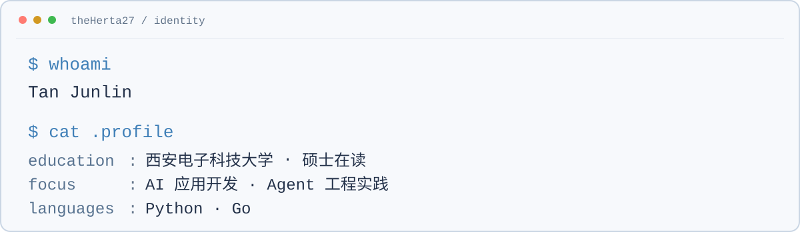

<picture>
  <source media="(prefers-color-scheme: dark)" srcset="./profile/header-dark.gif">
  <source media="(prefers-color-scheme: light)" srcset="./profile/header-light.gif">
  
</picture>

  <a href="#about">About</a>&nbsp;&nbsp;·&nbsp;&nbsp;
  <a href="#tech-stack">Tech Stack</a>&nbsp;&nbsp;·&nbsp;&nbsp;
  <a href="#github-activity">GitHub Activity</a>

---

## About

<picture>
  <source media="(max-width: 600px) and (prefers-color-scheme: dark)" srcset="./profile/about-mobile-dark.svg">
  <source media="(max-width: 600px) and (prefers-color-scheme: light)" srcset="./profile/about-mobile-light.svg">
  <source media="(prefers-color-scheme: dark)" srcset="./profile/about-dark.svg">
  <source media="(prefers-color-scheme: light)" srcset="./profile/about-light.svg">
  
</picture>

---

## Tech Stack

  <picture>
    <source media="(prefers-color-scheme: dark)" srcset="https://skillicons.dev/icons?i=py%2Cc%2Ccpp%2Cjs%2Cts%2Cgo%2Ccs%2Cfastapi&amp;theme=dark&amp;perline=8">
    <source media="(prefers-color-scheme: light)" srcset="https://skillicons.dev/icons?i=py%2Cc%2Ccpp%2Cjs%2Cts%2Cgo%2Ccs%2Cfastapi&amp;theme=light&amp;perline=8">
    
  </picture>
  <picture>
    <source media="(prefers-color-scheme: dark)" srcset="./profile/ai-stack-dark.svg">
    <source media="(prefers-color-scheme: light)" srcset="./profile/ai-stack-light.svg">
    
  </picture>

  <picture>
    <source media="(prefers-color-scheme: dark)" srcset="https://skillicons.dev/icons?i=git%2Cgithub%2Cdocker%2Clinux%2Cvscode%2Cpostgres%2Cmysql%2Credis%2Cunity%2Cunreal&amp;theme=dark&amp;perline=10">
    <source media="(prefers-color-scheme: light)" srcset="https://skillicons.dev/icons?i=git%2Cgithub%2Cdocker%2Clinux%2Cvscode%2Cpostgres%2Cmysql%2Credis%2Cunity%2Cunreal&amp;theme=light&amp;perline=10">
    
  </picture>

---

## GitHub Activity

  <picture>
    <source media="(prefers-color-scheme: dark)" srcset="./profile/stats-dark.svg">
    <source media="(prefers-color-scheme: light)" srcset="./profile/stats.svg">
    
  </picture>
  <picture>
    <source media="(prefers-color-scheme: dark)" srcset="./profile/top-langs-dark.svg">
    <source media="(prefers-color-scheme: light)" srcset="./profile/top-langs.svg">
    
  </picture>

Cards use public repository data. The native GitHub contribution graph below is the authoritative contribution total. Top Languages reflects repository composition, not proficiency.

<picture>
  <source media="(prefers-color-scheme: dark)" srcset="https://raw.githubusercontent.com/theHerta27/theHerta27/output/github-contribution-grid-snake-dark.svg">
  <source media="(prefers-color-scheme: light)" srcset="https://raw.githubusercontent.com/theHerta27/theHerta27/output/github-contribution-grid-snake.svg">
  
</picture>

---

  <strong>Currently building at <a href="https://github.com/theHerta27">@theHerta27</a></strong> 
  Backend systems · AI applications · Agent-based engineering

